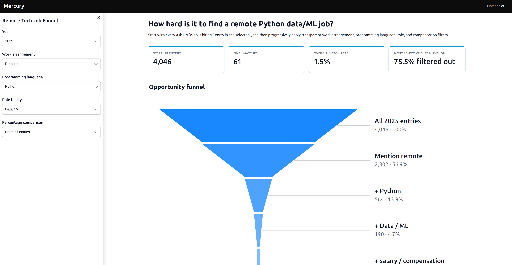
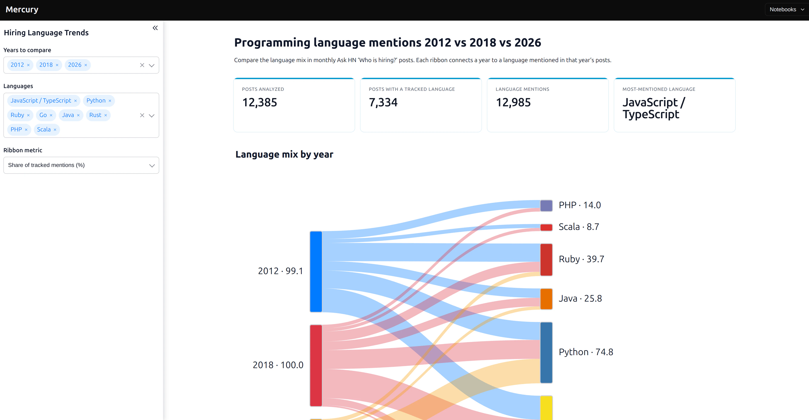

# Mercury Examples

Welcome! This repository contains simple examples of data apps built with
[Mercury](https://runmercury.com/). Each example starts as a Python notebook and
can be published as an interactive web app.

You can open a folder to read more, view the notebook, and find the data source.

## Examples

- [Tech layoffs activity calendar](layoffs/) shows daily layoffs from the
  Layoffs.fyi dataset.
- [GitHub incidents activity calendar](github-outages/) shows when GitHub
  incidents started and how long they lasted.
- [Who Is Hiring](who-is-hiring/) contains two apps made from Ask HN hiring
  posts:
  - [Remote Tech Job Funnel](who-is-hiring/who-is-hiring-funnel.ipynb) shows how
    each job-search requirement reduces the number of matching posts.
  - [Programming Language Sankey](who-is-hiring/language-mentions-sankey.ipynb)
    compares programming-language mentions across selected years.
- [Pivot table](pivot-table/) is an interactive table example.
- [PyDeck](pydeck/) is an interactive map example.

## App gallery

### GitHub incidents activity calendar

Choose a date range, impact, component, metric, and color from the sidebar.

### Remote Tech Job Funnel

Choose a year and job requirements to see how many hiring posts remain.

### Programming Language Sankey

Choose years and languages to compare their mentions in hiring posts.

## Getting started

Open an example folder and follow its README. You will need Python and Mercury.
The notebooks can be explored in Jupyter or served as web apps with the
`mercury` command.
