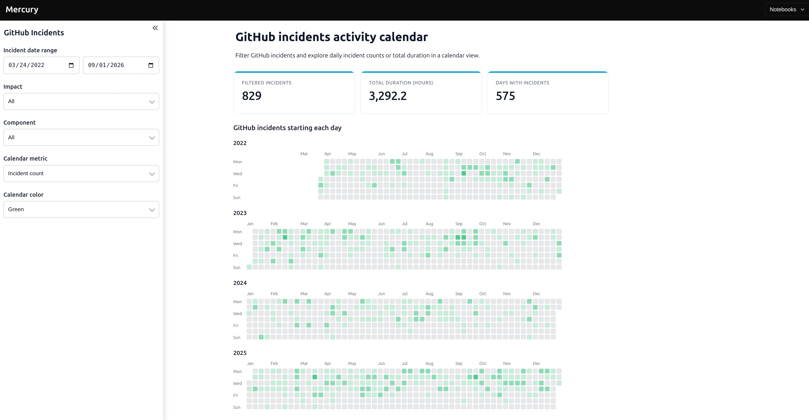
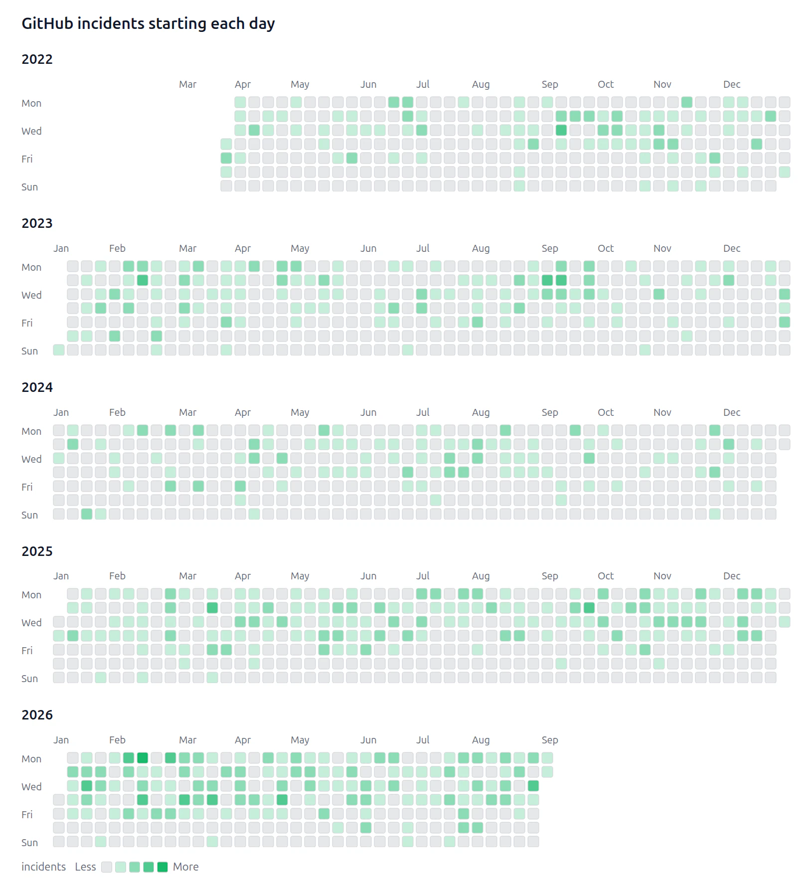

# GitHub Incidents Activity Calendar

Welcome! This example turns GitHub incident data into a calendar that looks
like the GitHub contribution calendar.

Open [`github-incidents-calendar.ipynb`](github-incidents-calendar.ipynb) to see
the Python code and run the analysis in Jupyter.



▶️ [Watch the 14-second app demo](media/github-outages-demo.mp4)

## What can I do in the app?

Use the sidebar to:

- choose a date range;
- filter by impact;
- filter by the affected GitHub component;
- show the number of incidents or their total duration;
- choose the calendar color.

The cards at the top show a quick summary. Each calendar square is one day. A
darker square means more incidents, or a longer total duration, depending on
the selected metric.



## Data source

The notebook downloads the parsed GitHub downtime data from the
[`mrshu/github-statuses`](https://github.com/mrshu/github-statuses) project:

[Download `downtime_windows.csv`](https://raw.githubusercontent.com/mrshu/github-statuses/refs/heads/master/parsed/downtime_windows.csv)

An internet connection is needed when the notebook loads the data. An
incident's full duration is assigned to the day when that incident started.

## Run the web app

From the main repository folder, run:

```bash
mercury --working-dir github-outages
```

Open the local address printed in the terminal. You can also learn more in the
[Mercury Activity Calendar documentation](https://runmercury.com/docs/output/activity-calendar/).
