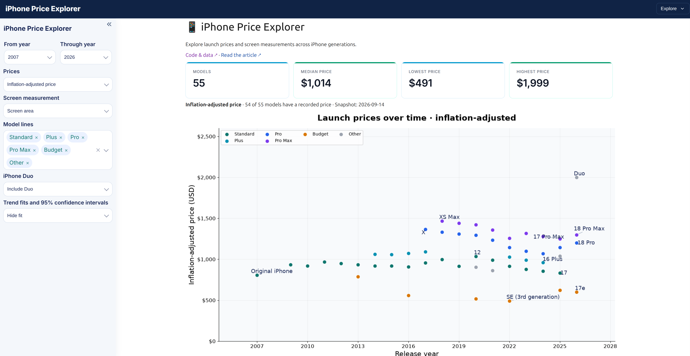

# iPhone Price Explorer

Explore prices and screen measurements across 55 iPhone models with a Mercury dashboard, Matplotlib charts, and large model labels positioned with adjustText.

[**Open the live app →**](https://iphone-dashboard.runmercury.com) · [Code & data](https://github.com/mljar/mercury-examples/tree/main/iphone-dashboard) · [Accompanying article (coming soon)](https://mljar.com/blog/iphone-prices-analysis/)



## Explore the dashboard

The defaults are **2007–2026**, **inflation-adjusted prices**, **screen area**, and all model lines selected. There are 55 models in this period, 54 with recorded prices. Select Through year **2025** to reproduce the article’s fitting period. Fits are hidden initially; select **Show fit** to display them.

- **Year range:** choose From year and Through year. Invalid ranges and empty selections show a warning without drawing results.
- **Prices:** choose original or inflation-adjusted prices. Both price charts keep the same y-axis limits when switching, calculated from both price columns in the current selection.
- **Screen measurement:** choose screen diagonal, screen area, or total screen area. Total area includes both screens for foldables.
- **Model lines:** filter Standard, Plus, Pro, Pro Max, Budget, and Other. Colors and classification match the article notebook.
- **iPhone Duo:** use **Include Duo / Exclude Duo** to compare its influence. The default is Include Duo; it only appears if the year and model-line filters include it.
- **Trend fits:** select Show fit or Hide fit to show or hide fitted lines, 95% confidence bands, and summaries.

Three charts show prices over time, price versus the selected screen measurement, and price per square inch over time. The last chart uses main-screen area unless Total screen area is selected. Each title includes the price basis.

Fit summaries report the equation, sample size, fitting period, R², RMSE, and a plain-language interpretation. Linear fits report the slope and its 95% confidence interval. The log-linear price-per-area trend reports annual percentage change and its 95% interval.

Cards show model count, median, lowest, and highest prices. A searchable table below the charts lists selected models, model lines, years, both prices, and screen areas. There is no CSV download control.

Charts use a compact 14 × 8 layout. All points remain visible; selections of up to 30 models label every point. Larger selections label notable models, price extremes, and the latest selected model in each family. Labels omit the “iPhone” prefix.

## Run locally

From this directory, create and activate a virtual environment:

```bash
python3 -m venv ../venv
source ../venv/bin/activate
```

Install dependencies and start the app:

```bash
pip install -r requirements.txt
mercury
```

Open the URL shown in the terminal and select **iPhone Price Explorer**.

You can also edit [iphone_dashboard.ipynb](iphone_dashboard.ipynb) in Jupyter or [MLJAR Studio](https://mljar.com), using the same Python environment.

## Data and fit notes

The app reads [iphone_prices_adjusted.csv](iphone_prices_adjusted.csv), a snapshot dated **2026-09-14**. All release statuses are included, including announced models. Statuses and verification labels come from the CSV; this is not a live data feed.

Original prices are nominal full-device launch prices with varying purchase conditions documented in the source CSV. **Inflation-adjusted prices are in August 2026 dollars, calculated with the US CPI-U index from the Bureau of Labor Statistics.** The app reads those prices and screen measurements directly from the CSV.

Missing measurements and prices are excluded from the corresponding chart and fit. A fit needs at least three complete observations and two distinct x values. Price-per-area trends also require positive prices and screen areas.

The first two charts use ordinary least squares. Their shaded bands are confidence intervals for the **mean trend**, not individual-phone prediction intervals. The third fits log(price per square inch) against year, matching the article. Its band is transformed from log space and describes the geometric trend rather than the arithmetic mean. Fits assume independent errors with constant variance on the fitted scale, weight models equally, and describe associations rather than causation.

The article uses **2007–2025** for fits. Dashboard fits use the current selection, including 2026 if selected. With all model lines, the 2007–2025 historical screen-area fit gives a slope of about **$35.29/in²** and **R² = 0.322**; the adjusted price-per-area trend is about **−5.47% annually**.

## Theme and dependencies

[config.toml](config.toml) defines the navy header, blue accents, light sidebar, rounded controls, typography, phone favicon, and welcome message. The welcome page links to the source code, data, and accompanying article. Start Mercury from this directory to load the configuration, and restart it after changing the theme.

Dependencies are listed in [requirements.txt](requirements.txt): Mercury 3.2.11, pandas, Matplotlib, adjustText, and statsmodels. See the [Mercury quick start](https://runmercury.com/docs/quickstart/) for more about serving notebooks.
