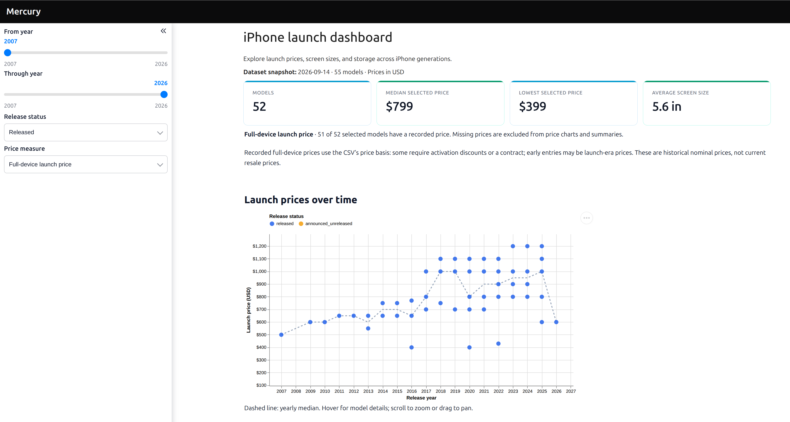

# iPhone launch dashboard

A Mercury notebook app for exploring the 55 iPhone models in [iphone_prices.csv](iphone_prices.csv), with interactive Altair charts.



## Run the example

From this directory, create the shared environment if it does not already exist:

```bash
python3 -m venv ../venv
```

Install dependencies and start Mercury:

```bash
# install dependencies
pip install -r requirements.txt
# start mercury server
mercury
```

Open the dashboard at 127.0.0.1. You can also open iphone_dashboard.ipynb in Jupyter or [MLJAR Studio](https://mljar.com) and edit dashboard.

Port 8889 avoids a typical Jupyter server on 8888. Automatic port retries are disabled so a busy port produces an error instead of silently changing the URL.

## Try it

The default view selects **Released** models from **2007–2026**, using **Full-device launch price**. It shows 52 models, 51 recorded prices, a $799 median price, and a $399 lowest price.

- Change the year sliders to compare generations.
- Select **All models** to include entries labeled announced/unreleased in the CSV.
- Switch to **Advertised launch price** to explore the separately recorded advertised prices.
- Hover over points for model details; scroll to zoom or drag to pan.
- Search the model table or download the filtered CSV with all original source columns.
- Expand **Source details & pricing notes** for purchase conditions and source links.

The charts show launch prices over time, including a yearly median, and screen size versus price. Summary cards and results update when Mercury filters change. Both x-axes include margins to keep edge points visible.

## Data notes

The supplied CSV is a snapshot dated **2026-09-14**, not a live feed. Release statuses and verification labels come from that file. Missing full-device prices remain missing; advertised contract/subsidized prices are available separately. Prices are nominal USD and can have different purchase conditions, documented in source details. Chart medians weight each model equally.

## Dependencies

Uses **Mercury 3.2.11** (latest published version checked on 2026-09-15) and **Altair 6**. Altair uses the Jupyter widget renderer with explicit chart widths because container sizing can collapse to zero in Mercury.

See the [Mercury quick start](https://runmercury.com/docs/quickstart/) for more about serving notebooks.
