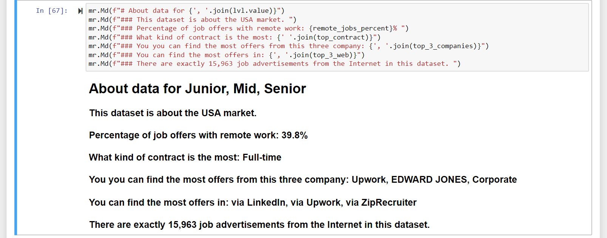
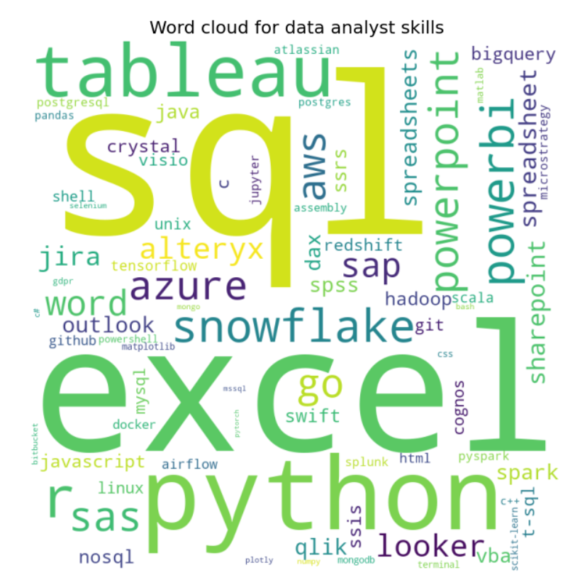
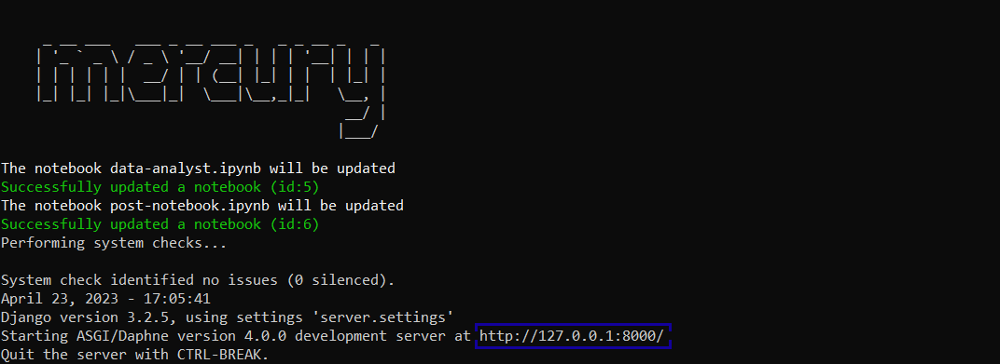
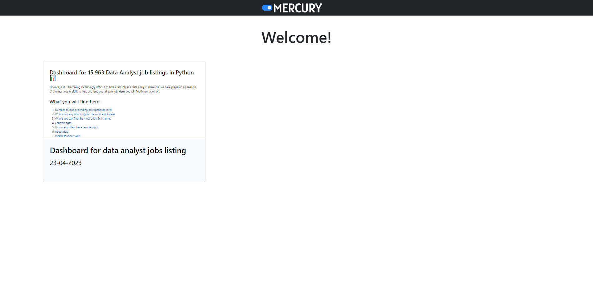
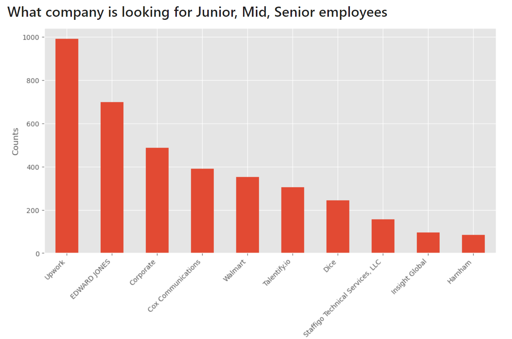
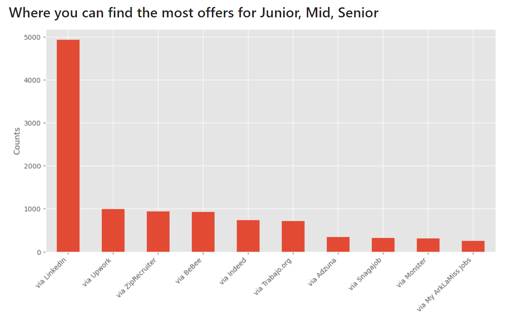
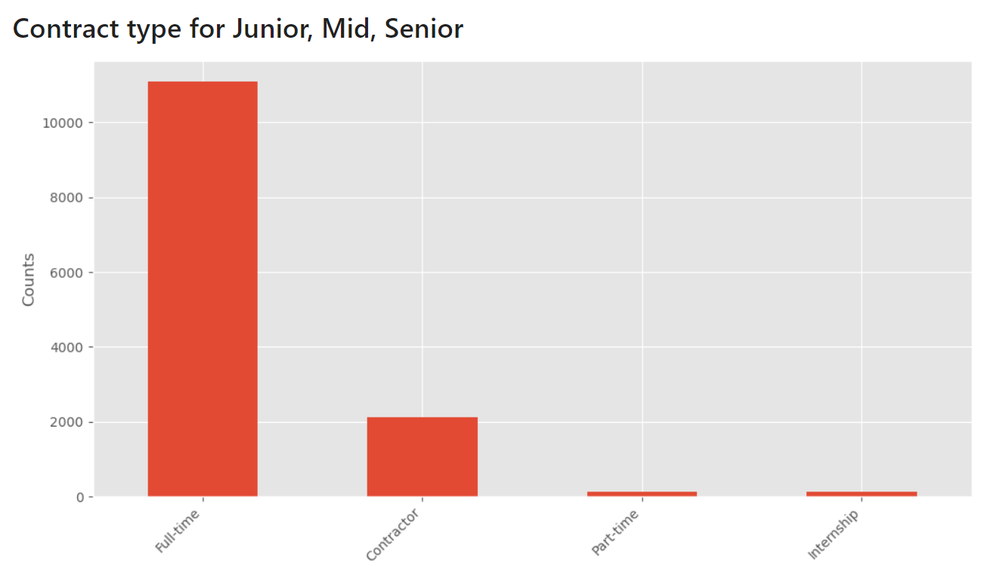
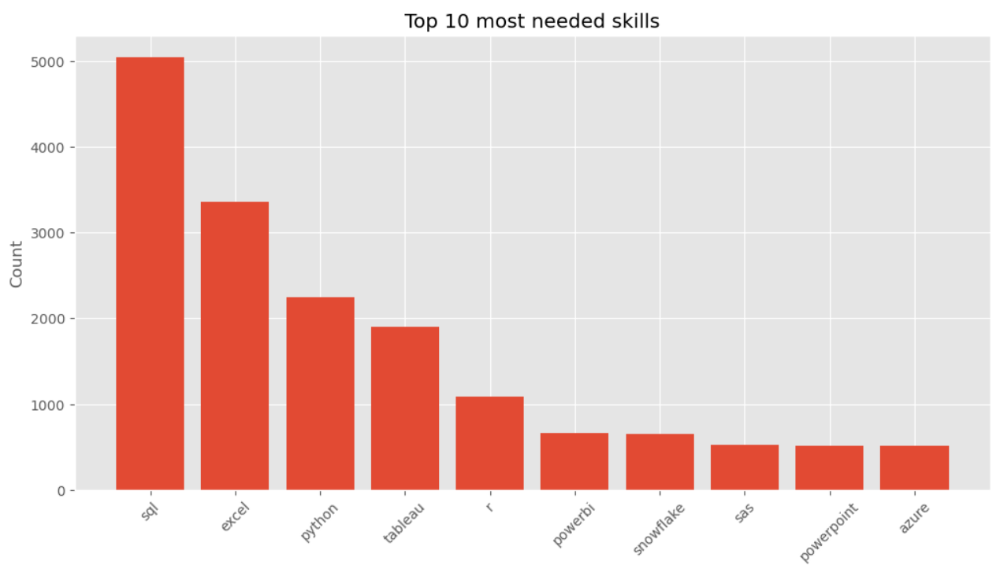

![graphic][1]

Data analyst is becoming an increasingly desirable profession, on the side of the employees as well as the company. No wonder, companies need specialists to help them make important business decisions. However, the market situation is becoming difficult, especially for people whose goal is getting their first job. In this tutorial, we will show you two useful things for you, namely: How to create a website using Mercury. And at the same time, we will analyze the job market to show you what skills will help you get your first job more easily! 
## About data
We will be using a dataset from kaggle.com [link here](https://www.kaggle.com/datasets/lukebarousse/data-analyst-job-postings-google-search?datasetId=2614070&sortBy=voteCount).

This dataset pulls job postings from Google's search results for Data Analyst positions in the United States. 
And, as is often the case with this type of data acquisition method, some data like to hide. Let's take a closer look at what we will have to deal with. 
- The dataset has 15,963 job offers. 
- 80% of the payout data is missing. Understandably, most companies will want to negotiate the price. 
## Import
It's time to open Jupyter Notebook, and **install Mercury** (if you haven't done this already).
```
pip install mercury
or
conda install -c conda-forge mercury
```
In the first cell, we will **import mercury** and other important library for this project.
```
import numpy as np
import pandas as pd

import matplotlib.pyplot as plt
import mercury as mr
from wordcloud import WordCloud

import re
from collections import Counter
from dateutil.parser import parse
from string import punctuation as punct
```
# Data processing
- We will create a new column **category** in which we will have the level of experience (Junior, Mid, Senior). Based on it, we will create charts for the levels.
- From the descriptions, we will take information regarding the **skills** that are required in each job offer. When we will have ready a column with skills as well as **salaries based** on them, we will draw conclusions which skills are more profitable.
- We will fill in the missing sallara values.

## Job experience
The first step will be to **create a set of keywords** for levels of experience as well as skill.
```
junior_keywords = {'junior', 'entry level', ...}
mid_keywords = {'mid-level', 'mid level', ...}
senior_keywords = {'senior', 'lead', ...}
keywords_programming = {'sql', 'python', ...}
keywords_libraries = {'scikit-learn', 'jupyter', ...}
keywords_analyst_tools = {'excel', 'tableau', ...}
```
Let's create a function that will assign columnists to a given division.
```
# function to assign an offer to a category
def categorize_job(row):
    title = row['title'].lower()
    description = row['description'].lower()
    for keyword in junior_keywords:
        if keyword in title or keyword in description:
            return 'Junior'
    for keyword in mid_keywords:
        if keyword in title or keyword in description:
            return 'Mid'
    for keyword in senior_keywords:
        if keyword in title or keyword in description:
            return 'Senior'
    return 'unknown'

# add column 
df['category'] = df.apply(categorize_job, axis=1)
```
The function **first converts the title and description** of the job to lowercase using the **lower()** method to ensure that all keywords are matched regardless of case. **Next, the function iterates over each keyword** in the junior, mid and senior keywords lists. If a keyword is found in either the title or the description, the function **returns the corresponding category** (Junior, Mid, or Senior). **If none of the keywords are found, the function returns 'unknown'.**

Now that we have assigned a category to each job listing, we can further clean the data by removing job listings that belong to the "unknown" category.
```
df = df.drop(df[df['category'] == 'unknown'].index)
```

## Skills

It's time for finding skills in offers.
Let's **combine our keywords for skills**, and drop data with null description.
```
keywords = keywords_programming.union(keywords_libraries).union(keywords_analyst_tools)

#drop rows with null descriptions
jobs_all = df.dropna(subset=['description']).reset_index()
```

```
from collections import Counter

keyword_counts = Counter()
for description in jobs_all['description']:
    words = description.lower().split()
    keyword_counts.update(set(words).intersection(keywords))
```
The code initializes a **Counter** object to **count the number of occurrences** of each keyword in a set of job descriptions. It then **iterates through each description**, converts it to lowercase, splits it into individual words, and **updates the Counter** object with the number of occurrences of each keyword in that description.

## Missing salary
Let's **standardize and extract salary** information from the 'salary' column in the jobs_all dataframe.
```
#this cell wos write by LUKE BAROUSSE

# Separate 'salary' column into that for min max avg and rate (e.g., hourly)
jobs_all[['salary_pay', 'salary_rate']] = jobs_all.salary.str.split(' ', 1, expand=True)

jobs_all.salary_pay = jobs_all.salary_pay.str.replace(',', '').str.replace('$', '').str.replace(' ', '')
jobs_all['salary_avg'] = np.where(jobs_all.salary_pay.str.contains("–"), np.NaN, jobs_all.salary_pay)  

jobs_all['salary_min'] = np.where(jobs_all.salary_pay.str.contains("–"), jobs_all.salary_pay, np.NaN)
jobs_all[['salary_min', 'salary_max']] = jobs_all.salary_min.str.split("–", 1, expand=True)

for column in ['salary_avg', 'salary_min', 'salary_max']:
    jobs_all[column] = np.where(jobs_all[column].str.contains("K"), jobs_all[column].str.replace("K", "").astype(float) * 1000 , jobs_all[column] )
jobs_all['salary_avg'] = np.where(~jobs_all.salary_min.isnull(), (jobs_all.salary_min.astype(float) + jobs_all.salary_max.astype(float))/2 , jobs_all.salary_avg)

jobs_all['salary_hourly'] = np.where(jobs_all.salary_rate == 'an hour', jobs_all.salary_avg.astype(float), np.NaN)
jobs_all['salary_yearly'] = np.where(jobs_all.salary_rate == 'a year', jobs_all.salary_avg.astype(float), np.NaN)
```
It first **separates** the 'salary' column into columns for pay (annual salary) and rate (e.g., hourly, monthly). It then **extracts** the minimum, maximum, and average salary values, and converts any salary values expressed in thousands of dollars to absolute values.
```
# Standardize salary to all be annual
jobs_all['salary_standardized'] = np.NaN
salary_rate = {'a year': 1, 'an hour': 2080, 'a month': 12}
for key, index in salary_rate.items():
    jobs_all.salary_standardized = np.where(jobs_all.salary_rate == key, jobs_all.salary_avg.astype(float) * index, jobs_all.salary_standardized)
```
Next, it calculates the standardized annual salary by **multiplying the hourly and monthly** salaries by their respective multipliers (2080 and 12, respectively).
```
# Used to check results as built above
salary_df = jobs_all[~jobs_all.salary.isnull()]
salary_df = salary_df[['company_name', 'salary', 'salary_pay', 'salary_rate', 'salary_avg', 'salary_min', 'salary_max', 'salary_standardized', 'salary_hourly', 'salary_yearly']] #, 'salary_min', 'salary_max']
pd.set_option('display.max_rows', salary_df.shape[0]+1)
```
Finally, it creates several **new columns** in the jobs_all dataframe to store the standardized salary, hourly salary, and yearly salary, and creates a salary_df dataframe for checking the results.

# Adding widgets and create charts
We are only a few lines of code away from creating a website. But to have something to show, we need to add couple functions from Mercury to make our interactive charts and information.

## Show or hide code switch
The task of this cell is to determine the **checkbox**, so that we can decide with one click whether we want to show our code on the page.
```
show_code_switch = mr.Checkbox(label="Show code", value=False)
```

## Mercury App
To create a fully functioning site, we need to specify a feature called Mercury App. 
Try to describe your project originally, it will help you later to locate your work.

```
app = mr.App(title="Analysis for analysts",description="Data analysis relating to the skills a Data Analyst needs.", show_code=show_code_switch.value)
```

Mercury after running this cell will pop you a notification, "Mercury Application This output won't appear in the web app."
**Your notebook can officially be a page now**. But before we launch it, let's add some widgets and create charts. 

## MultiSelect for experience

In this scenario, we want to **add MultiSelect** for the job expertise as well as for your skills. Let's define our first MultiSelect as well as **specify our options to choose from**.
```
lvl = mr.MultiSelect(value=['Junior','Mid','Senior'],choices=['Junior','Mid','Senior'], label="Choose youre level")
```
The task of the next cell is to **select from our DataFrame the levels** of advancement we have chosen.
```
df_lvl = df[df.category.isin(lvl.value)]
```

And just create a graph using **matplotlib**. 
```
#defind size and style
plt.figure(figsize=(12,6))
#add only to first plot
plt.style.use('ggplot')

#create plot
level = df_lvl['category'].value_counts()
level.plot(kind='bar')

#add text
plt.title(mr.Md(f"# Number of jobs for {', '.join(lvl.value)}"))
plt.ylabel("Counts")
plt.xticks(rotation=45)

plt.show()
```
The title is formatted using the f-string format and the **join() method to concatenate** the values in the **lvl variable**.
From now on, our chart will show only what we have marked and only the title for ouer specyfic levels.

**The next three charts** are done exactly the same way, just change the column name in the **df_lvl[ ]** to something else, for example:
- 'company_name'
- 'via'
- 'schedule_type'
## Remote work

```
dummies = pd.get_dummies(df_lvl['work_from_home'], prefix='remote', prefix_sep='_')
```
To make a chart with remote work, I chose the **get_dummies** function from the pandas library. The **pd.get_dummies()** function **creates new columns** with the prefix 'remote_' and binary values for each unique value from the 'work_from_home' column.
```
plt.figure(figsize=(12,6))
counts = dummies.value_counts()
yn = ["You can't work remotley", 'You can work remotely']
plt.bar(yn, counts)
```
The task of **yn is to change the names** of the straw charts to my choice.

## Creating Markdown
If you want to add more specyfic information about data you can use **Markdown**, with this you can change value for your text.
```
top_3_companies = df_lvl['company_name'].value_counts().nlargest(3).index.tolist()

top_contract = df_lvl['schedule_type'].value_counts().nlargest(1).index.tolist()

top_3_web = df_lvl['via'].value_counts().nlargest(3).index.tolist()
```
The first line of code **top_3_companies** counts the frequency of values in the column 'company_name' of the df_lvl, **selects the top three most frequently occurring** values, and **converts them to a list.** 

```
remote_jobs_percent = round((df_lvl['work_from_home'].sum() / len(df_lvl)) * 100, 1)
```
The fourth line of code **remote_jobs_percent** calculates the percentage of rows in the df_lvl that have the value 'True' in the 'work_from_home' column, **rounds the**
**result to one decimal place**, and assigns the value to the variable **remote_jobs_percent.**

To create text that will use our variable data we will use a function in mercury called **Markdown.** 



## Word Cloud
To make our presentation more interesting we can add **Word Cloud.** This is a **collection of all the sub-counted words,** the size of the word depends on the number of times the word is repeated in the text.

```
# sort the keywords by frequency in descending order
sorted_counts = keyword_counts.most_common()

# create a dictionary from the sorted_counts variable
word_dict = dict(sorted_counts)

# generate the word cloud
wordcloud = WordCloud(width = 800, height = 800, 
                background_color ='white', 
                min_font_size = 10).generate_from_frequencies(word_dict)
```



## MultiSelect for skills

Let's add another **MultiSelect** to our code. What's good about this module is that you can add **as many options as you want.**
```
sk_set = mr.MultiSelect(choices=['sql', 'python','snowflake'...], 
                        label="Choose your skills", value=['sql', 'python'...])
```
```
sk_df = skills_df[skills_df.skill.isin(sk_set.value)]
```
The second cell just like **df_lvl** creates us a dataframe that is **customized to our selected options** in MultiSelect. 
```
fig, ax = plt.subplots(figsize=(12,6))
ax.bar(sk_df['skill'], sk_df['avg_salary']*12, color='red', alpha=0.8)
ax.set_xlabel('Skills')
ax.set_ylabel('Avg. salary yearly')
ax.set_title('Average salaries by skills')
plt.xticks(rotation=45)

# Set y-axis ticks and labels
max_salary = sk_df['avg_salary'].max() * 12
yticks = np.linspace(0, max_salary, 10)
yticklabels = ['$' + '{:,.0f}'.format(y) for y in yticks]
ax.set_yticks(yticks)
ax.set_yticklabels(yticklabels)
plt.show()
```
Second part of the code sets the **y-axis** ticks and labels using the maximum salary value, max_salary, and the **np.linspace()** function, which **creates a linearly spaced** array of values. The **yticklabels** are formatted as dollar values with comma separators using the **'{:,.0f}'.format()** string formatting method.

And all done!

## Mercury run
Mercury will read all your code and **create a web app**. Now open your the command line and navigate to the location of your notebook. Once you've set everything up just type **mercury run** in the terminal.



The application should open the page by itself, but if it doesn't, you can copy the html: from your ternimal.

![mercury-menu]

If everything has been done correctly, you should now see this screen and your file.
When you click on it, your own page will open.



# Market analysis
As you can see, Mercury gives time-savers and changes ordinary notebooks to a more user-friendly as well as adding interact with data. Let's move on to analyzing the market situation.

## Who is looking for the largest number of analysts?
The freelance company **Upwork** with more than 2,000 job offerts is dramatically breaking through.



## Where can you find the most job offerts?
**Linkedin** is positioned first, and right after that we see Upwork again.



## What are the types of conctract?
Of course, most companies need **full-time analysts**.And when it comes to the possibility of working 
remotely there are more than 5,000 listings with this option.



## What skills are most in demand? 
According to the chart, the most sought-after skills are **SQL, Excel and Python.**



But companies will be more willing to pay you more if you will known: **Tableaut, Snowflake and SQL**.


# Summary
In this project, not only did we learn how to use Mercury and find out what the market situation is like, but we also saw what it is like to work in this field. In summary, mercury is able to create us a functioning website in just a few lines of code and, in addition, using **Markdown and Multiselect**, adds the ability to interact with data easily.  
