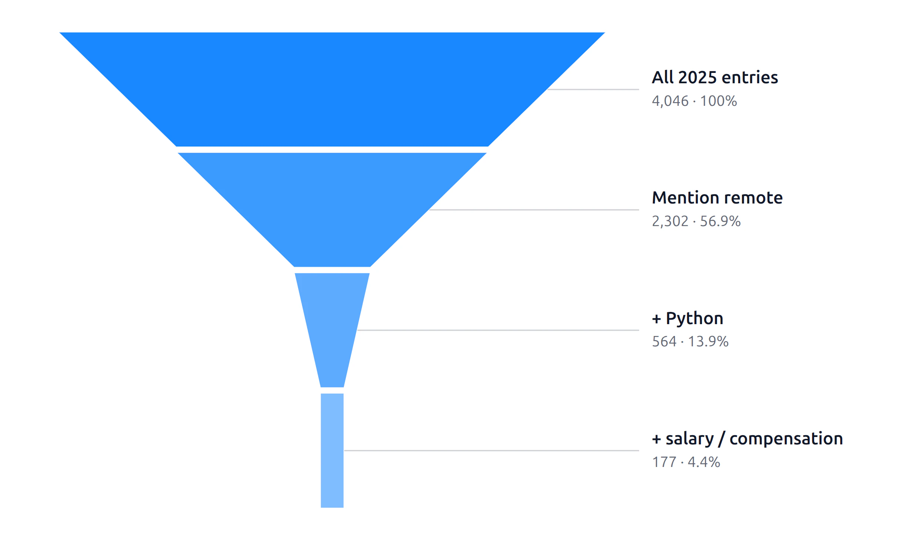
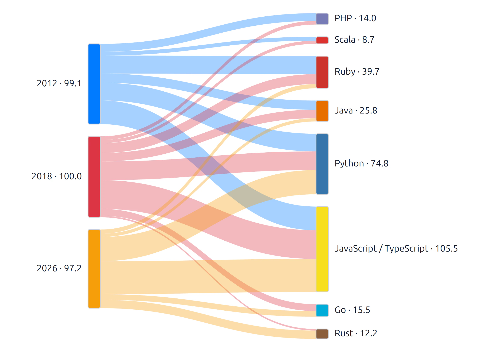

# Who Is Hiring

Welcome! This folder contains two Mercury apps built from monthly Ask HN
“Who is hiring?” posts:

- [`who-is-hiring-funnel.ipynb`](who-is-hiring-funnel.ipynb) helps you narrow a
  job search step by step.
- [`language-mentions-sankey.ipynb`](language-mentions-sankey.ipynb) compares
  programming-language mentions across years.

## Remote Tech Job Funnel

This app asks a simple question: **How hard is it to find a remote Python data
job?**


Start with all posts from one year. Then choose a work arrangement, programming
language, and role family. The funnel becomes smaller after every requirement.
It finishes with posts that also mention salary or compensation.

You can choose **All** for work arrangement, language, or role family. The app
then skips that step. The title, summary cards, funnel, explanation, and results
table update automatically.

The default search uses 2025, Remote, Python, and Data / ML. It goes from 4,046
posts to 61 posts that also mention salary or compensation.



Read the [Mercury Funnel documentation](https://runmercury.com/docs/output/funnel/)
to learn about the widget.

## Programming Language Sankey

This app compares language mentions in hiring posts. The default years are
2012, 2018, and 2026.


Use the sidebar to choose years, languages, and one of these metrics:

- **Share of tracked mentions (%)** shows a language's part of all selected
  language mentions in each year.
- **Post mentions** shows how many different posts mention the language.

One post can mention several languages. A language is counted only once in each
post. Languages found in fewer than 2% of a year's posts are hidden, which keeps
the chart easy to read. You can change this fixed value with
`MIN_POST_SHARE_PCT` inside the notebook.



The lines connect each year to languages mentioned in that year. They do not
mean that one programming language changed into another. The number beside a
language adds together its lines from all selected years. A value above 100 in
percentage mode is therefore a total across years, not a percentage for one
year. Use the table in the app to see each year's value.

Read the [Mercury Sankey documentation](https://runmercury.com/docs/output/sankey/)
to learn about the widget.

## Data

The local files contain 88,975 comments from monthly
[Ask HN: Who is hiring?](https://news.ycombinator.com/) threads from 2012 through
2026. The 2026 file contains only part of the year.

The data is split into small, compressed files such as
`who_is_hiring_2025.csv.gz`. The funnel loads one year. The Sankey loads only
the years you select. All files together use about 36 MiB. The original CSV
used about 102 MiB.

The apps use simple keyword matching. The results are useful for exploring the
data, but they are not exact counts of jobs. One post may contain several jobs,
and a word may be used in a different meaning.

## Run both web apps

From the main repository folder, run:

```bash
pip install -r who-is-hiring/requirements.txt
mercury --working-dir who-is-hiring
```

Mercury will find both notebooks and show them as separate apps. Open the local
address printed in the terminal to get started.
